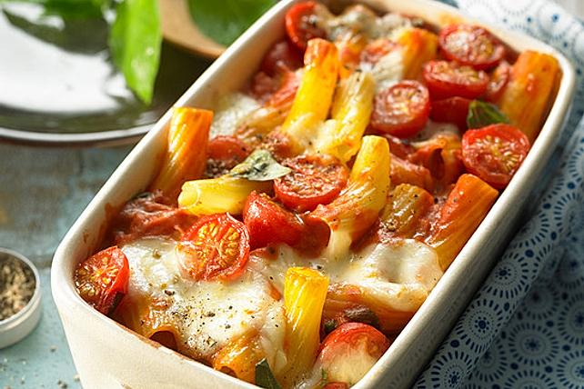

# rezepte_zoerix

# POFFERTJES

Was sind Poffertjes?
Poffertjes sind eine niederländische Gebäckspezialität, die traditionell mit Butter und Puderzucker, in den Niederlanden oft auch mit Zuckerrübensirup, serviert werden. Die kleinen, münzgroßen Pfannküchlein sind relativ dick und deutlich süßer als klassische Pfannkuchen. Hierzulande kennt man Poffertjes von Jahr- und Weihnachtsmärkten.

#### Zutaten

| Menge | Zutat |
|-------|-------|
|300 ml | Milch |
|250 gr | Mehl  |
| 1 Pck | Trockenhefe|
| 4     | Eier|
| 2 EL  | Zucker|
| 1 Prise | Salz|
| 4 EL  | Puderzucker |

#### Zubereitung:

1. Milch leicht erwärmen. Mehl, Hefe, Eigelb, Zucker und Salz zusammen mit der warmen Milch in eine Schüssel geben und zu einem glatten Teig verrühren. Anschließend mit einem sauberen Küchentuch abdecken und bei Zimmertemperatur 30 Minuten gehen lassen.
2. Eiweiß steif schlagen und unterheben.
3.  Poffertjes-Pfanne fetten und erhitzen. Teig mit einer Kelle oder einem Spritzbeutel in die Mulden geben und nach ca. 1 Min. wenden. Haben die Poffertjes eine gold-braune Farbe auf beien Seiten, können sie mit Butter und Puderzucker serviert werden. Dazu passen Eis, Kompott oder Vanillesauce.

# NUDELAUFLAUF

#### Zutaten

| Menge | Zutat |
|-------|-------|
| 1     | Zwiebel|
| 2     | Knoblauchzehen|
| 1     | Chilischote (frisch) |
| 400 gr| Cherrytomaten |
| 50 gr | Parmesan |
| 125 gr| Mozzarella|
| 1 Bund| frisches Basilikum |
| 400 gr| Rigatoni oder Penne |
| 500 gr| passierte Tomaten|
| 250 ml| Sahne |
| 1 Prise | Salz und Pfeffer |
| 1 Prise | Zucker|
| ....| Olivenöl|

#### Zubereitung

1. Den Ofen auf 200 °C Ober-/Unterhitze (Umluft 180 °C) vorheizen.
2. Die Zwiebel und den Knoblauch sehr fein schneiden. Die Chilischote entkernen und ebenso fein hacken. Die Kirschtomaten waschen und halbieren. Den Parmesan reiben und den Mozzarella grob würfeln. Die Basilikumblätter abzupfen, waschen und trocken tupfen.
3. In einem großen Topf Salzwasser zum Kochen bringen und die Nudeln darin laut Packungsangabe al dente garen.
4. Währenddessen in einer großen Pfanne Olivenöl erhitzen und Zwiebel, Knoblauch und Chilischote darin anschwitzen. Die passierten Tomaten hinzufügen und die Sauce ein paar Minuten leicht köcheln lassen. Dann die Sahne und den geriebenen Parmesan unterrühren und die Sauce mit Salz, Pfeffer und einer ordentlichen Prise Zucker abschmecken.
5. Wenn die Nudeln soweit sind, diese abgießen und in die Pfanne zur Sauce geben. Die Pfanne von der Hitze nehmen und die halbierten Kirschtomaten und die Hälfte der Mozzarellawürfel unterheben. Die Basilikumblätter in Streifen schneiden und ebenfalls unterheben.
6. Alles zusammen in eine Auflaufform geben, mit dem restlichen Mozzarella bestreuen und ca. 20 Minuten auf der mittleren Schiene im heißen Backofen gratinieren.

